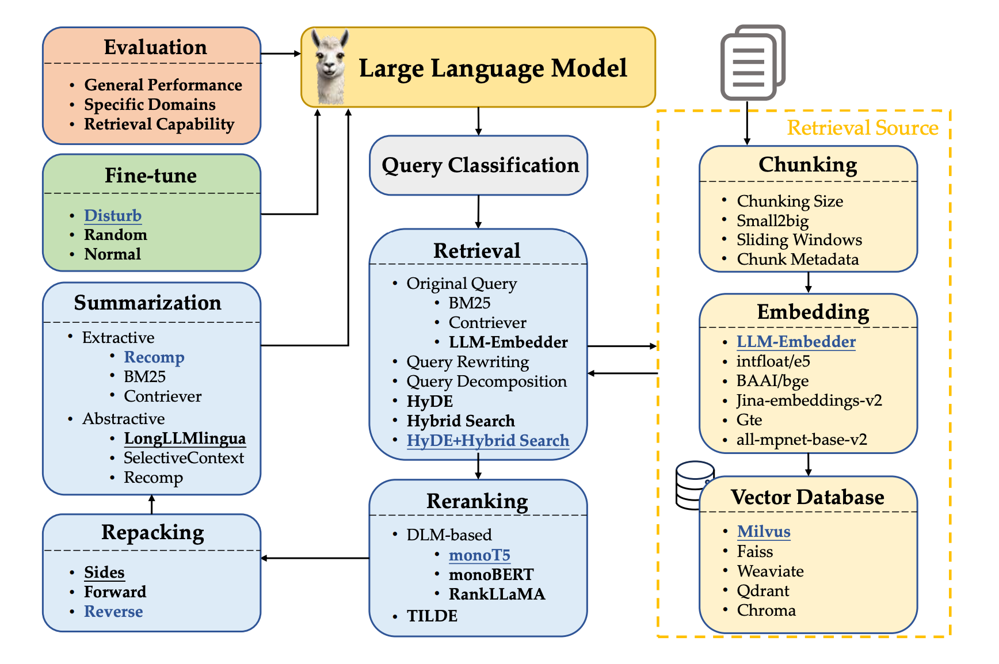

# Best Practices in Retrieval-Augmented Generation

Generative Large Language Models (LLMs) are prone to generating outdated information or fabricating facts. Retrieval-Augmented Generation (RAG) techniques combine the strengths of pre-training and retrieval-based models to mitigate these issues, enhancing model performance.

By integrating relevant, up-to-date information, RAG improves the accuracy and reliability of responses. Additionally, RAG enables rapid deployment of applications without the need to update model parameters, provided that query-related documents are available.

This article delves into optimal practices for RAG, aiming to balance performance and efficiency.

<!-- more -->

<figure markdown="span">
  
  <figcaption>Retrieval-augmented generation workflow.</figcaption>
</figure>
