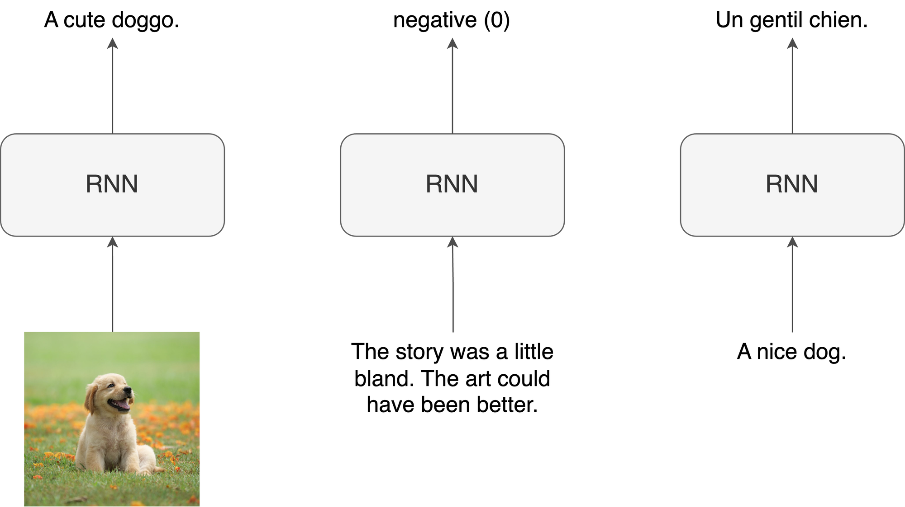
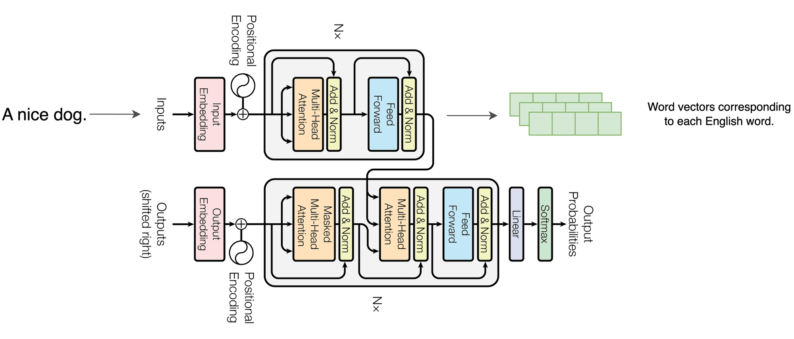
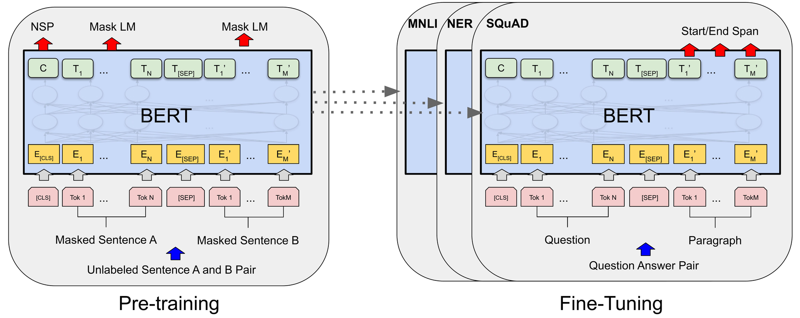
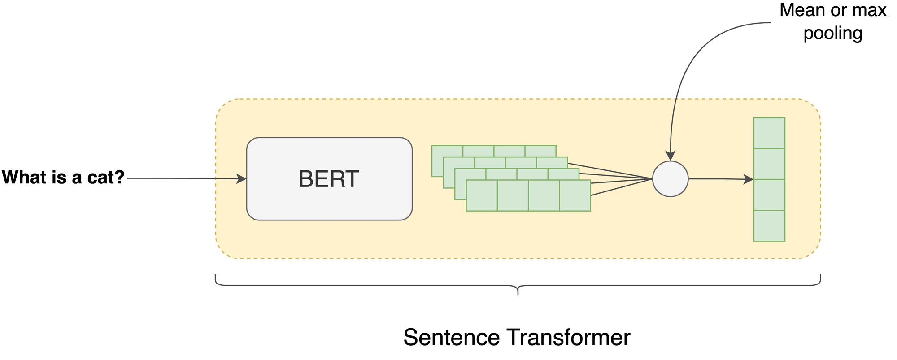
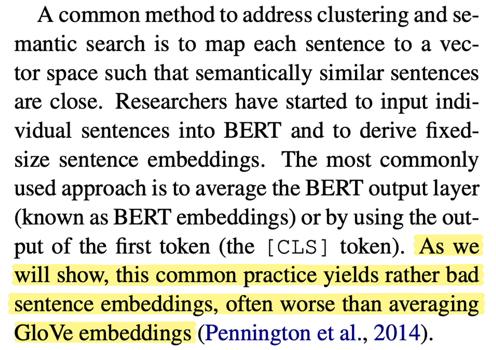
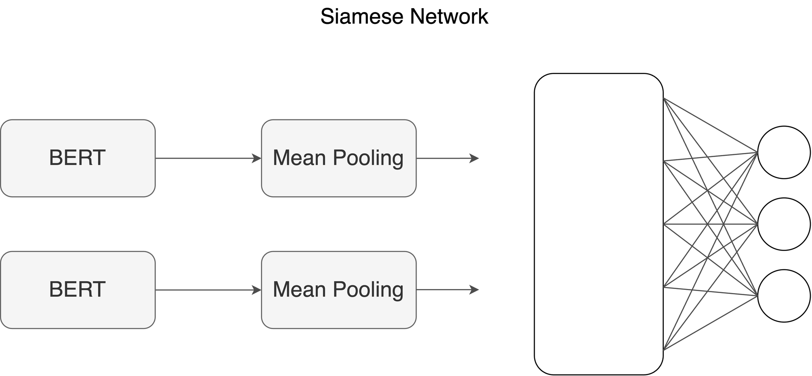
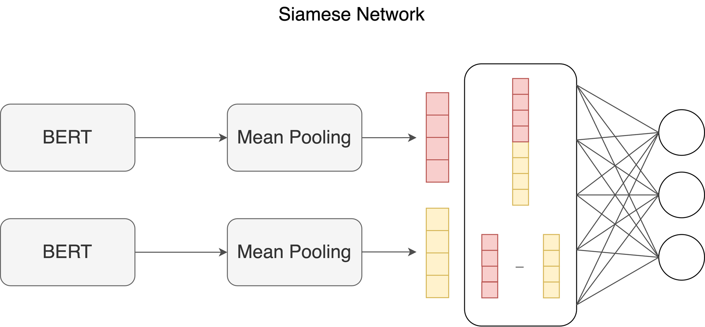
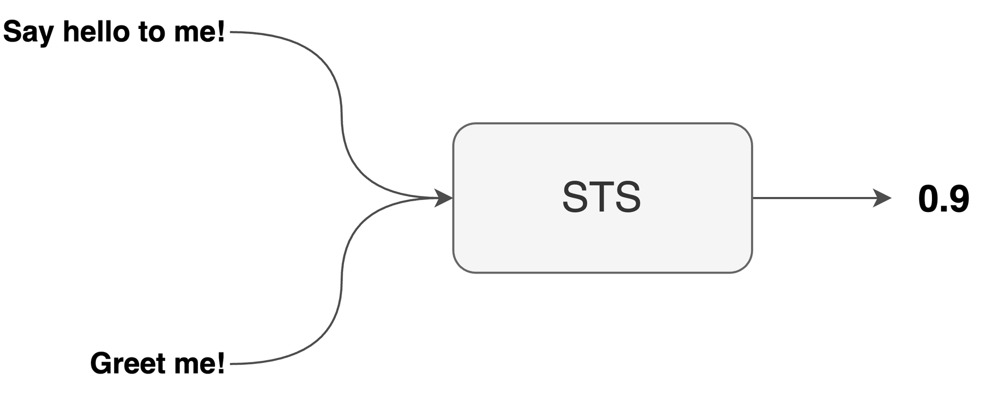
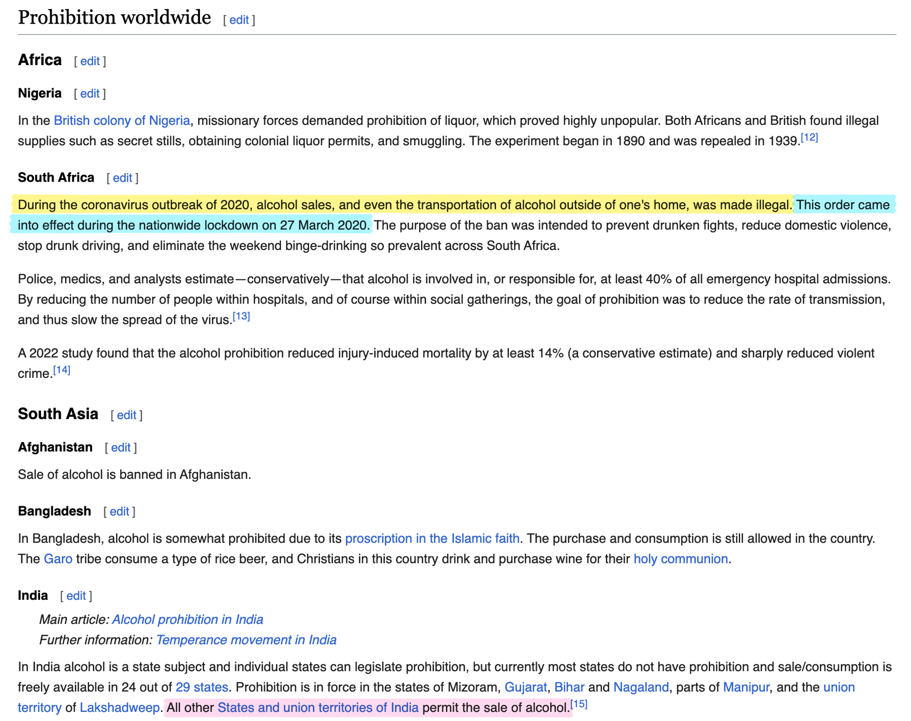
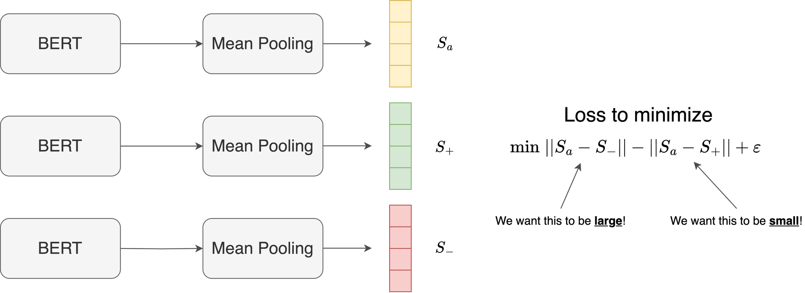

# Sentence Transformers for Sentence Similarity

In this article, we we will take a look at the history leading up to the creation of Sentence Transformers, the shortcomings of past architectures across various NLP tasks (mainly sentence similarity) and how Sentence Transformers tackle these problems.

<!-- more -->

## Introduction 

<figure markdown="span">
  
  <figcaption>Overview history of Sentence Transformer.</figcaption>
</figure>

## Recurrent Networks

<figure markdown="span">
  
  <figcaption><b>From left to right:</b> Vector-to-sequence, Sequence-to-vector and Sequence-to-sequence.</figcaption>
</figure>

Clearly, Recurrent Neural Networks (RNNs) are versatile but for language problems, they have their disadvantages:

### Disadvantages

1. **Slow to train and slow at inference**
    - This is because the input words are processed one at a time, sequentially. Therefore, longer sentences just take a longer time.
2. **Do not truly understand context**
    - RNNs only learn about a word based on the words that came before it. In reality, the context of a word depends on the sentence as a whole.
    - Bidirectional LSTMs try to address this but even here, the left to right and right to left context are learnt separately and are concatenated so some of the true context are lost.

## Transformer Networks

<figure markdown="span">
  { width=500 }
  <figcaption>The encoder-decoder structure of the Transformer architecture. Taken from <a href="https://arxiv.org/abs/1706.03762">“Attention Is All You Need“</a>.</figcaption>
</figure>

<figure markdown="span">
  
  <figcaption>A sentence passing through the Transformer generating an embedding vector for each word.</figcaption>
</figure>

For English to French translation, we pass in the entire English sentence into the encoder simultaneously. Then, we get the corresponding word vectors simultaneously. These word vectors encode the meaning of the word and they are better than RNNs because they understand bidirectional context through attention units.

Now we pass these vectors into the decoder along with the previously generated French words to generate the next French word in the sentence. We keep passing the French words that were generated into the decoder until we hit the end of sentence.

Transformers work well for sequence to sequence problems but for the specific natural language problems like question answering and text summarization, even Transformers have drawbacks related to one fact — language is complicated.

## Disadvantages

1. **Need a lot of data**
2. **Architecture may not be complex enough**
    - Transformers may not be complex enough to understand patterns to solve these language problems. After all, Transformers weren’t designed to be language models so the word representations generated can still be improved.

## BERT Networks

BERT was introduced to extend the capabilities of the Transformer. BERT was built with the ideology that different Natural Language Processing (NLP) problems all rely on the same fundamental understanding of language.

<figure markdown="span">
  
  <figcaption>Overall pre-training and fine-tuning procedures for BERT. Apart from output layers, the same architectures are used in both pre-training and fine-tuning. The same pre-trained model parameters are used to initialize models for different down-stream tasks. During fine-tuning, all parameters are fine-tuned. [CLS] is a special symbol added in front of every input example, and [SEP] is a special separator token (e.g. separating questions/answers).</figcaption>
</figure>

### Phases

BERT undergoes two phases of training:

1. **Pre-Training: Understand Language**
2. **Fine Tuning: Understand Language specific tasks** 

### Advantages over Transformers

1. **~~Needing a lot of data~~** → Fine tuning does not require obscene amounts of data
2. **~~Architecture may not be complex enough~~** → BERT is a stack of Transformer encoders and is therefore known as **B**&#8203;idirectional **E**&#8203;ncoder **R**&#8203;epresentations from **T**&#8203;ransformers. 
    - **Bidirectional:** It is bidirectional since it understands the context of words looking both ways via attention.
    - **Encoder** & **Transformers:** Since BERT is essentially a stack of the encoder part of the Transformer.
    - **Representations:** Since BERT is pre-trained to be a language model, it better understands word representations. This means the output word vectors from BERT better encapsulates the meaning of the words in sentences.

<figure markdown="span">
  
  <figcaption>Various NLP tasks.</figcaption>
</figure>

The big takeaway here is that BERT can now solve a host of complex language specific problems except for one type.

---

!!! example "💭 Imagine"

    Imagine you’re a Data Scientist at Quora which is a question answer site and you want to design a system that find related questions to the one that is currently being asked. How would we solve this with BERT?

    <figure markdown="span">
      { width=500 }
      <figcaption>You're a Data Scientist trying to design a system that find related questions to the one that is currently being asked</figcaption>
    </figure>

**Goal:** Determine questions similar to the one being asked. 

<figure markdown="span">
  
  <figcaption>A simple schematic diagram illustrating the process of embedding the words across many sentences.</figcaption>
</figure>

**Steps:**

1. First take the question that is being asked and another question that had been asked in the past, pass both of these questions into BERT
2. BERT generates word vectors 
3. Pipe these word vectors into some feed forward layer such that the output would be a single neuron corresponding to the similarity score 
4. Repeat the steps for every question on the platform to compute the pairwise similarity 
5. Select the highest similarity scores and the corresponding questions will be the most similar and relevant to the question that is being asked

!!! warning 

    However, there is a big issue here. If there are 100 million questions on the platform, we’d have to run the forward pass of BERT 100 million times every single time a new question comes in. This is not viable!

So the next question so ask is: how do we make BERT work for the [current goal](#goal)?

## Sentence Transformers

### Pass 1: High Level Idea 

<figure markdown="span">
  
  <figcaption><b>Embedding space:</b> It contains vectors of the questions that represent meaning.</figcaption>
</figure>

**Steps:**

1. We would want to pass the new question into BERT to get a single vector that represents the meaning of the question.
2. Compare the vector of the new question to the vectors of all other questions using a similarity metric (i.e. cosine similarity).
3. Return the nearest neighbours as the most related questions to the new question.

Therefore, for every new question asked, we only require a single forward pass of the BERT model [not 100 million times as mentioned before](#warning). This is great because computing simple similarity metrics between vectors is much cheaper than passing in all questions on the platform through the complex model every time you need to make a decision.

### Pass 2: Sentence Transformers

In the [first pass](#pass-1), a new question is passed into BERT to get a single vector that represents the question. However, BERT only gives us word vectors. Therefore, in order to get a single vector, you’ll need to somehow aggregate these word vectors by passing it through some unit. 

The most straightforward way of doing this is to take the average of these vectors. This is known as mean pooling. Another way is to take the maximum value across every dimension of the embedding. This is known as max pooling.

<figure markdown="span">
  
  <figcaption>BERT outputs vectors for each word so in order to get a vector for the question/sentence, we need to aggregate these word vectors. This is the simplest form of a Sentence Transformer.</figcaption>
</figure>

The diagram above shows the simplest form of a Sentence Transformer but the output vector generated is extremely poor quality. Its quality is so poor that you might be better off simply taking the average of GloVe embeddings (and not even using BERT).

<figure markdown="span">
  
  <figcaption><b>Source:</b> Sentence-BERT: Sentence Embeddings using Siamese BERT-Networks <a href="https://arxiv.org/pdf/1908.10084">https://arxiv.org/pdf/1908.10084</a></figcaption>
</figure>

**How to get sentence vectors with meaning?**

In order for BERT to create sentence vectors that actually have meaning, we need to further train it (fine-tune) on sentence level tasks (refer to [next section](#pass-3) for more information).

Once we train (fine-tune) BERT on one or all of these tasks, the sentence vector generated becomes a good representation of the sentence — that is, it encodes the meaning of the sentence very well.

This is important since it means that closer the vectors are in terms of distance, the more similar is the meaning.

!!! info 

    In our [Quora questioning setting](#imagine), we would pass every question through the sentence transformer once and store them somewhere for future use. Then when a new question comes in, we pass only that question through the sentence transformer to get the sentence vector representation and then determine the questions with the highest cosine similarity and surface them as related questions. We can find the nearest neighbours through some nearest neighbours techniques:

    - ANNOY (Approximate Nearest Neighbours)
    - KNN Elastic Search

### Pass 3: Sentence Transformers Training 

BERT is good at word representations but we want to make a Sentence Transformer that is good with sentence representations. To do this, we fine-tune BERT on any or all of the three sentence related tasks:

1. Natural Language Inference (NLI)
2. Sentence Text Similarity (STS)
3. Triplet Dataset

#### Natural Language Inference (NLI) 

<figure markdown="span">
  
  <figcaption><b>Natural Language Inference:</b> Does sentence 1 entails or contradicts sentence 2? If neither, the “neutral” category will should be predicted.</figcaption>
</figure>

NLI is a task that takes in two sentences and determines if sentence 1 entails or contradicts sentence 2 or simply neither. See some examples below:

!!! example "Examples"

    **Entailment**

    - Sentence 1: *“Say hello to me!”*
    - Sentence 2: *“Greet me!”*

    ---

    **Neutral**

    - Sentence 1: *“Say hello to me!”*
    - Sentence 2: *“Two people greeting and playing together.”*

    ---

    **Contradiction**

    - Sentence 1: *“Say hello to me!”*
    - Sentence 2: *“You’re ignoring me!”*

This allows BERT to understand sentence meanings as a whole. For training NLI, a Siamese network is used. “Siamese” means twins so we have two of the exact same Sentence Transformer networks connected in this fashion. 

<figure markdown="span">
  
  <figcaption>A Siamese Network.</figcaption>
</figure>

If we want to compare two sentences, we pass them through the different BERT networks to get word representations. These word vectors are then combined to create a sentence vector and then concatenate the two sentence vectors and their difference. The output is a softmax classification which can be one of these three classes — entailment, contradiction or neutral.

<figure markdown="span">
  
  <figcaption>Concatenating the two sentence vectors and their difference.</figcaption>
</figure>

!!! note

    Note that the mean pooling and concatenation look really arbitrary but they were chosen because they yielded the best results than any other strategy — like choosing max pooling or simply only considering the absolute difference between the vectors instead. 

During inference time, we only need the Sentence Transformer piece where we get a question and then we get the corresponding sentence vector. This vector is the sentence representation that encodes the meaning of the sentence (very well, hopefully).

#### Sentence Text Similarity (STS)

Another task we can use to fine-tune BERT to understand sentences is using STS. Given two sentences, output the score of how similar they are.

<figure markdown="span">
  
  <figcaption><b>Sentence Text Similarity:</b> How similar is sentence 1 to sentence 2?</figcaption>
</figure>

Just like [NLI](#nli), this is also trained with a Siamese network. During training, we pass the two sentences to compare through different Sentence Transformers to get these sentence vectors and then compute the cosine similarity between these sentence vectors to get the a value between $-1$ and $1$. These are then compared to an actual labelled similarity rating on a scale of $1$ to $5$ which is normalized to be comparable to the output score. We minimize the squared difference between the two so that the model can be trained.

<figure markdown="span">
  
  <figcaption>Consine similarity between two sentences.</figcaption>
</figure>

#### Triplet Dataset

A third type of task that we can train Sentence Transformers is using a dataset that has triple of sentences. The main sentence is called the “anchor”, the next sentence is a sentence that is “related” and the last sentence being one that is “unrelated” to the “anchor”. 

<figure markdown="span">
  
  <figcaption><b>Triplet Dataset:</b> One sentence is the anchor, another is a related sentence to the anchor and the other is unrelated.</figcaption>
</figure>

We can quickly make this type of dataset by picking a Wikipedia page, then choosing a sentence to be the “anchor” and the next sentence in the same paragraph can be chosen as the “related” sentence and then choose a sentence from another paragraph as the “unrelated” sentence. See screenshot below for an example.

<figure markdown="span">
  
  <figcaption>Yellow sentence being the anchor. Blue sentence being the related sentence and pink sentence being the unrelated sentence.</figcaption>
</figure>

The network is a triplet (not siamese, or twins) of the exact same Sentence Transformer architectures. During training, we pass each sentence through a Sentence Transformer to get three sentence vectors; $S_{a}$, $S_{+}$ and $S_{-}$.

We want to make sure the distance between the anchor and the related sentence is small and the distance between the anchor and unrelated sentence is large. This is so that the meanings are learned.

<figure markdown="span">
  
  <figcaption>Loss to minimize in the Triplet dataset.</figcaption>
</figure>

#### Conclusion

Regardless which of the tasks is chosen for training the Sentence Transformers, during inference time, we should be able to pass in some sentences and generate sentence representation vectors that encode the meaning of the sentences very well.

### Pass 4: Sentence Transformers Inference

Going back to our [Data Science job at Quora](#imagine), how do we recommend similar questions? Before additional questions are asked, we want to pass in every single question/sentence through the fine-tuned Sentence Transformer to get the corresponding sentence vectors. These vectors are good sentence representations (if fine tuning did not go wrong). These vectors all live in a space also known as the embedding space [as previously seen above](#imagine).

Next, when a new question comes in, we pass it through our Sentence Transformer to get the sentence representation or sentence embedding. Next, we determine the cosine similarity between the new question and every other candidate question. Finally, we will return the closest questions list as the related questions.

For small datasets, we can determine the cosine similarity for a new question with every other question but it becomes increasingly harder to do when there are hundreds and millions of questions (very common especially on a platform like Quora).    

<figure markdown="span">
  
  <figcaption>Quora Statistics 2024.</figcaption>
</figure>

To solve this issue, there are a couple of algorithms we can use. Spotify uses an [Approximate Nearest Neighbours algorithm called ANNOY](https://github.com/spotify/annoy) to recommend music to you. In this case, songs are embedded into vectors.

Another way to quickly compute the nearest neighbours is through [AWS which has an extremely efficient implementation of the k-Nearest Neighbours algorithm](https://docs.aws.amazon.com/opensearch-service/latest/developerguide/knn.html).

## Summary

### Recurrent Neural Networks

**Advantages**

- Able to deal with Sequence-to-Sequence problems

**Disadvantages**

- Slow to train and during inference
- Do not truly understand context

### Transformers

**Advantages**

- Replace Recurrent units with Attention units, addressing past concerns
- Solves Sequence-to-Sequence problems

**Disadvantages**

- Not necessarily complex enough to understand language

### BERT

**Advantages**

- Stack of Transformer encoders
- Complex enough to solve a host of NLP problems

**Disadvantages**

- Not good with sentence similarity tasks

### Sentence Transformers

**Advantages**

- Fine tunes BERT on Sentence Similarity Tasks, addressing past concerns