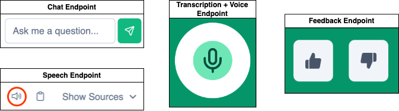

# Endpoints

!!! NOTE "For testing"

    Run the webapp locally first before testing the endpoint

---

<figure markdown="span">
  
  <figcaption>Endpoint diagram with buttons</figcaption>
</figure>

<swagger-ui src="endpoints.json"/>
