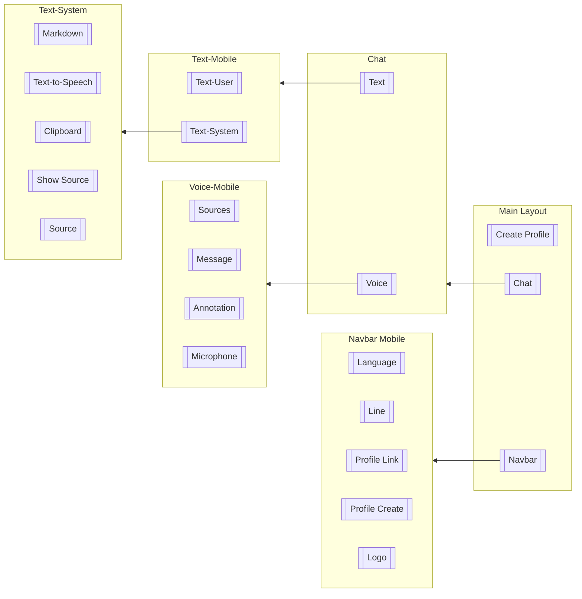

# Dependency Overview

```mermaid
flowchart RL
    subgraph ml [Main Layout]
    direction RL
    create[[Create Profile]]
    chat[[Chat]]
    nav[[Navbar]]
    end

    subgraph navbar [Navbar Mobile]
    direction RL
    lang[[Language]]
    line[[Line]]
    proflink[[Profile Link]]
    profcreate[[Profile Create]]
    logo[[Logo]]
    end

    subgraph chatpage [Chat]
    direction RL
    voice[[Voice]]
    text[[Text]]
    end

    subgraph voicepage [Voice-Mobile]
    direction RL
    sources[[Sources]]
    message[[Message]]
    annotation[[Annotation]]
    mic[[Microphone]]
    end

    subgraph textpage [Text-Mobile]
    direction RL
    user[[Text-User]]
    system[[Text-System]]
    end

    subgraph textsystem [Text-System]
    direction RL
    md[[Markdown]]
    tts[[Text-to-Speech]]
    clipboard[[Clipboard]]
    showsource[[Show Source]]
    source[[Source]]
    end

    chat --> chatpage
    nav --> navbar
    voice --> voicepage
    text --> textpage
    system --> textsystem
```
