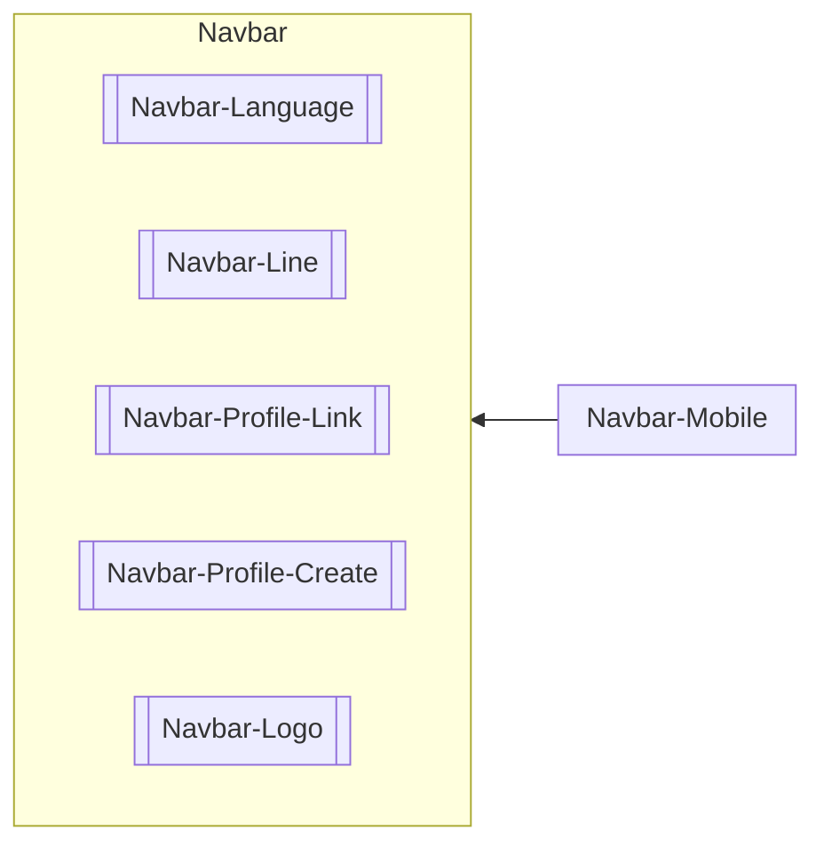

# Navbar

This component constitutes two folders under the component directory, `navbar` and `navbar-mobile`.

## @label(class) Navbar-Mobile

The former was the desktop version of the navbar which was always displayed on the left side, while the latter was developed for the mobile platform.

The root `navbar` component is currently unused, however its sub-components are used in the `navbar-mobile` component.

`navbar-mobile` is currently displayed on both the desktop and mobile platforms and comprises of three elements, a menu button on the left side, the application name in the center, and a toggle button on the right side.

The menu button toggles the sidebar which renders the following sub-components in the this order:

- `navbar-language`
- `navbar-line`
- `navbar-profile-link`
- `navbar-profile-create`
- `navbar-logo-group`

PrimeNG's `<p-sidebar>` component was used to render the sidebar. Which is hidden by default.

On initialization, @label(attr) `sidebarOpen` is set to `false` and a list of @label(attr) `Profile` objects is fetched from the IndexedDbStore by subscribing to a behaviour subject. @label(attr) `chatMode` currently active is also fetched from the @label(service) `PreferenceService`.

## @label(class) Navbar-Language

The `navbar-language` component is a dropdown menu that allows the user to change the language of the LLM output.

Uses PrimeNG's `p-dropdown` component to render the dropdown menu.

#### @label(attr) `languageMap`

Instantiated as @label(interface) `languageMap`.

#### @label(attr) `chosenLanguage`

Retrieved from the @label(service) `PreferenceService`.

#### @label(meth) setLanguage

Updates @label(service) `Preferences` local storage of `Language`.

## @label(class) Navbar-Line

HTML element that renders line that seperates components.

## @labell(class) Navbar-Profile-Link

List of @label(interface) `Profile` objects that is rendered sequentially

#### @label(attr) isActive

Boolean value that determines if the profile is active, creating a gray shadow background for the active profile.

#### @label(attr) gender

String literal that determines the profile picture used for each profile.

#### @label(attr) contextMenuItems

A list of @label(interface) `MenuItem` options that is rendered when the user right clicks on the profile link.

#### @label(meth) getProfileDescription

getProfileDescription(): string

Description
: Returns a string literal that describes the profile.

Parameters
: None

## @label(class) Navvbar-Profile-Create

HTML element that redirects user to the profile creation page.

## @label(class) Navvbar-Logo-Group

HTML element that dislpays tagline at bottom of sidebar.
