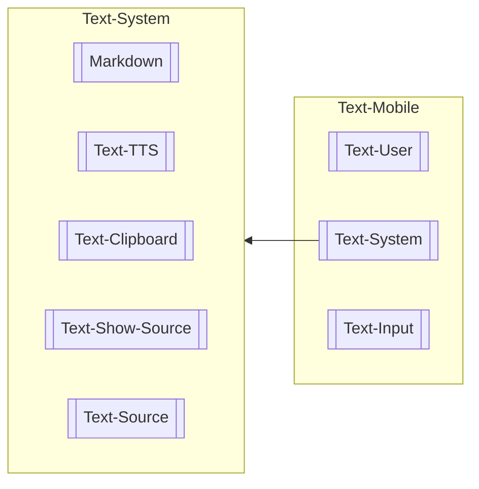

# Text

This component constitutes two folders under the component directory, `text` and `text-mobile`. 

## Dependency Overview

## @label(class) Text-Mobile
Component that fetches the active profile and uses the ID of the active profile to fetch the messages from the index store.

### Attributes

#### @label(attr) profile
`BehaviorSubject<Profile>` object that tracks the value which is of @label(type) `Profile`.

#### @label(attr) messages
`Message[]` object that contains the list of @label(type) `Message` fetched from index store.

## @label(class) Text-User
Component that takes in @label(type) `Message` with `user` tag and renders the message.

### Attributes

#### @label(attr) message
`Message` object that contains the message to be rendered.

## @label(class) Text-System
Component that takes in @label(type) `Message` with `system` tag and renders the message. 

### Sub-Components

#### @label(class) Markdown
Component that takes in @label(type) `String` from @label(type) `Message` and renders the message as markdown.

Utilizes third-party package [ngx-markdown](https://www.npmjs.com/package/ngx-markdown) to ingest markdown content provided by LLM.

#### @label(class) Text-TTS
Component that takes in @label(type) `String` from @label(class) `Message` and sends the string to the server for text-to-speech.

#### @label(class) Text-Clipboard
Component that takes in @label(type) `String` from @label(class) `Message` and copies the string to the clipboard.

#### @label(class) Text-Show-Source
Component that renders a button to toggle the displaying of sources returned by LLM.

#### @label(class) Text-Source
Component that takes in list of @label(type) `MessageSource` and renders it.

### Attributes

#### @label(attr) message
`Message` object that contains the message to be rendered.

