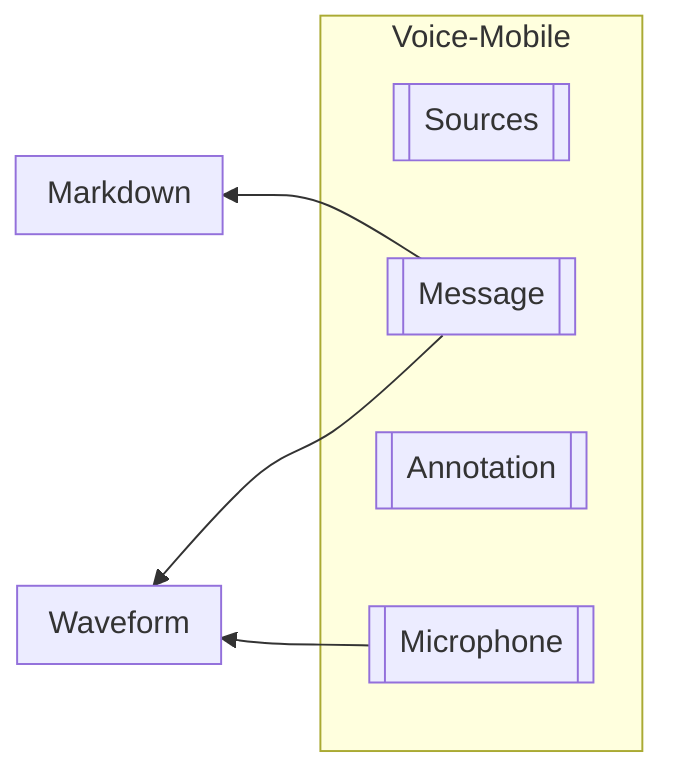

# Voice

## @label(class) Voice (Deprecated)

## @label(class) Voice-Mobile

### Sub-Components

#### @label(class) Sources
Component that takes in list of @label(type) `MessageSource` and renders them using `PrimeNG`'s `<p-carousel>` component.

#### @label(class) Message
Component that takes in @label(type) `String` and renders the message using the @label(class) `Markdown` component.

Also makes use of @label(class) `Waveform` for the box shadow element when the message is being read out.

#### @label(class) Annotation
Component that displays a popup when clicked, and allows user to provide feedback of the output by LLM.

#### @label(class) Microphone
Component that takes in @label(type) `MicState` and renders the microphone icon differently based on the state of the use case.

`PENDING` state is when the application is waiting for the user to click the microphone icon.

`DISABLED` state is when there is a callback in progress.

`ACTIVE` state is when the user is actively recording.