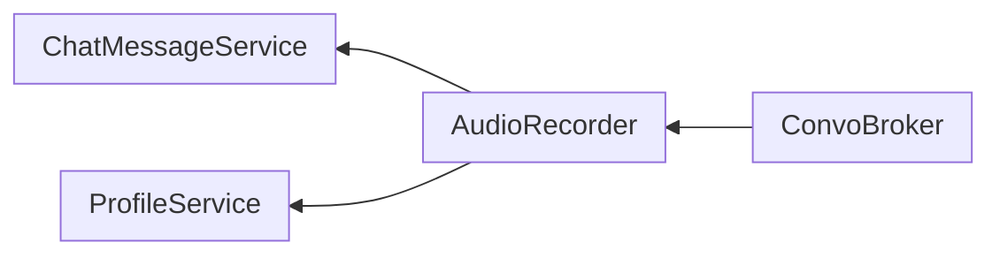

# Audio Recorder

A class to handle audio recordings and processing.

## @label(class) AudioRecorder (Deprecated)

## @label(class) v2AudioRecorder

Utilizes WebSockets to deliver PCM audio data to the server for transcription.

### Attributes

#### @label(attr) socket

`WebSocket` object that contains interface for interacting with the server.

#### @label(attr) audioContext

`AudioContext` object that contains interface for interacting with the audio.

#### @label(attr) processor

`ScriptProcessorNode` object that contains interface for direct audio processing.

#### @label(attr) pcmData

`Int16Array[]` object that contains the transformed audio data.

#### @label(attr) userMessageId

`string` literal that is a local instance of the message ID in the index store.

#### @label(attr) activeProfile

`BehaviorSubject` observable that holds value of current user profile.

#### @label(attr) finalText

`string` literal that is a local instance of the transcribed audio.

#### @label(attr) requestTime

`number` literal that is a local instance of the request time.

### Methods

#### @label(meth) setupWebSocket

    setupWebSocket(): void

Description
: Calls @label(meth) `startAudioCapture` to start audio capture and processing and setting up of websocket connection. Defines set of functions to be called on websocket events.

Parameters
: None

Returns
: None

#### @label(meth) startAudioCapture

    startAudioCapture(): void

Description
: Grabs microphone stream, processes it into PCM audio format, and sends it to the server for transcription.

Parameters
: None

Returns
: None

#### @label(meth) stopAudioCapture

    stopAudioCapture(): Promise<string>

Description
: Clears @label(attr) `processor` and @label(attr) `audioContext`, closes the websocket connection and calls @label(meth) `upsert` to update the index store of messages.

Parameters
: None

Returns
: `Promise<string>` to be used in @label(service) `ConvoBroker` to send the transcribed audio to the server for LLM query.

#### @label(meth) resetFields

    resetFields(): void

Descriiption
: Resets @label(attr) `finalText`, @label(attr) `userMessageId`, @label(attr) `isFinal` and @label(attr) `requestTime` to default values.

Parameters
: None

Returns
: None

#### @label(meth) sendAllPcmData

    sendAllPcmData(): void

Description
: Sends array of PCM data to the server for transcription.

Parameters
: None

Returns
: None

#### @label(meth) upsert

    async upsert(finalText: string): void

Desccription
: Calls @label(service) `chatMessageService`'s @label(meth) `upsert` to insert or update the index store of messages.

Parameters
: `finalText` (`string`): Transcribed question asked by the user

Returns
: None
