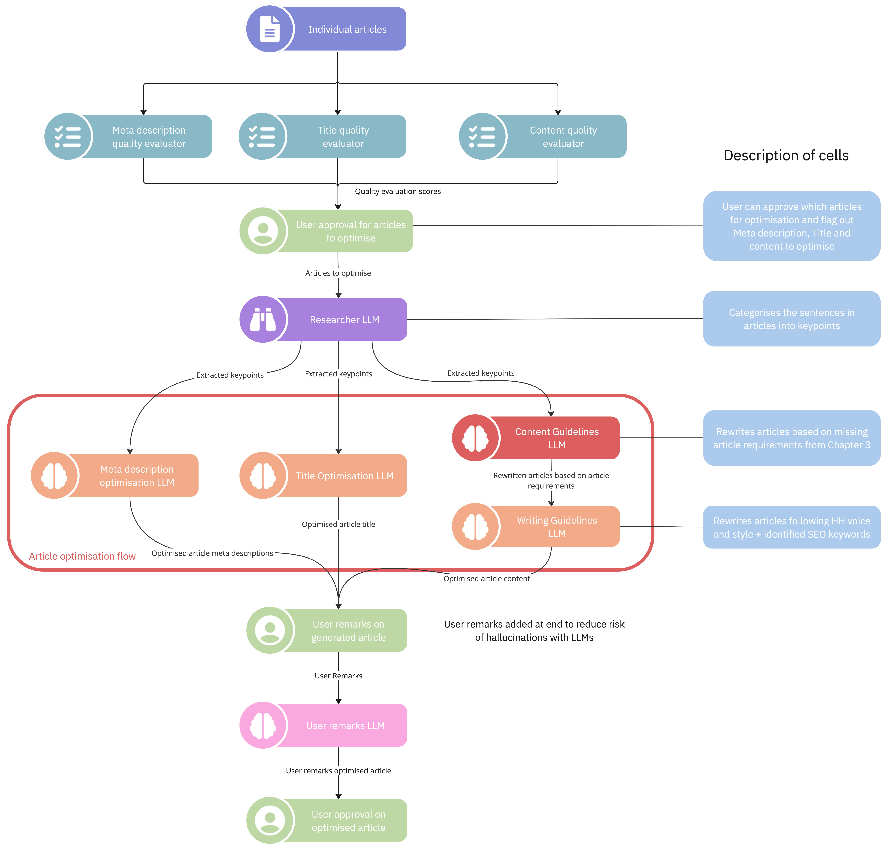

# Introduction

Our primary objective is to reduce the workload in the manual review process. It aims to identify areas for improvements across three different areas -

1. Article Content
2. Article Title
3. Article Meta Description

## Workflow

