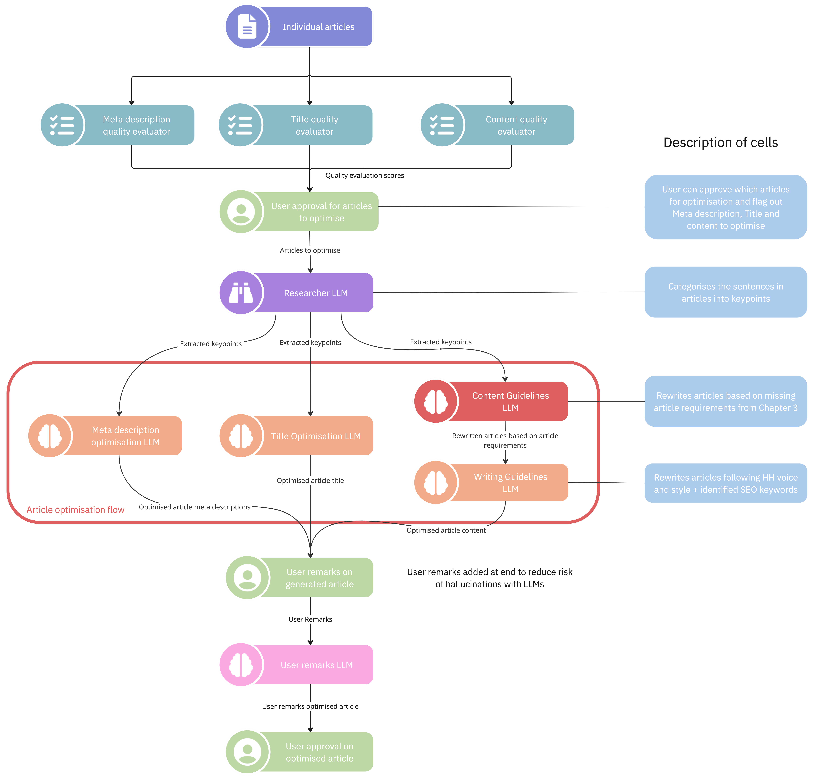

# Introduction

Our primary objective is to reduce the workload in the manual review process. It aims to identify and optimise the articles across three different areas -

1. Article Content
2. Article Title
3. Article Meta Description

## Workflow

### Optimisation Workflow

For individual articles, the initial steps of the Article Rewriting Workflow is to evaluate the quality of the article based on its content, title and meta description. We utilise both Rules, Statistics and Large Language Models (LLMs) to perform these evaluations.
Then, these evaluations are later shared to the users for approval/refinement. Finally, the selected articles (together with their evaluations) are passed down to the `Article Optimisation Flow` to refine and optimise the articles.

### Harmonisation Workflow

