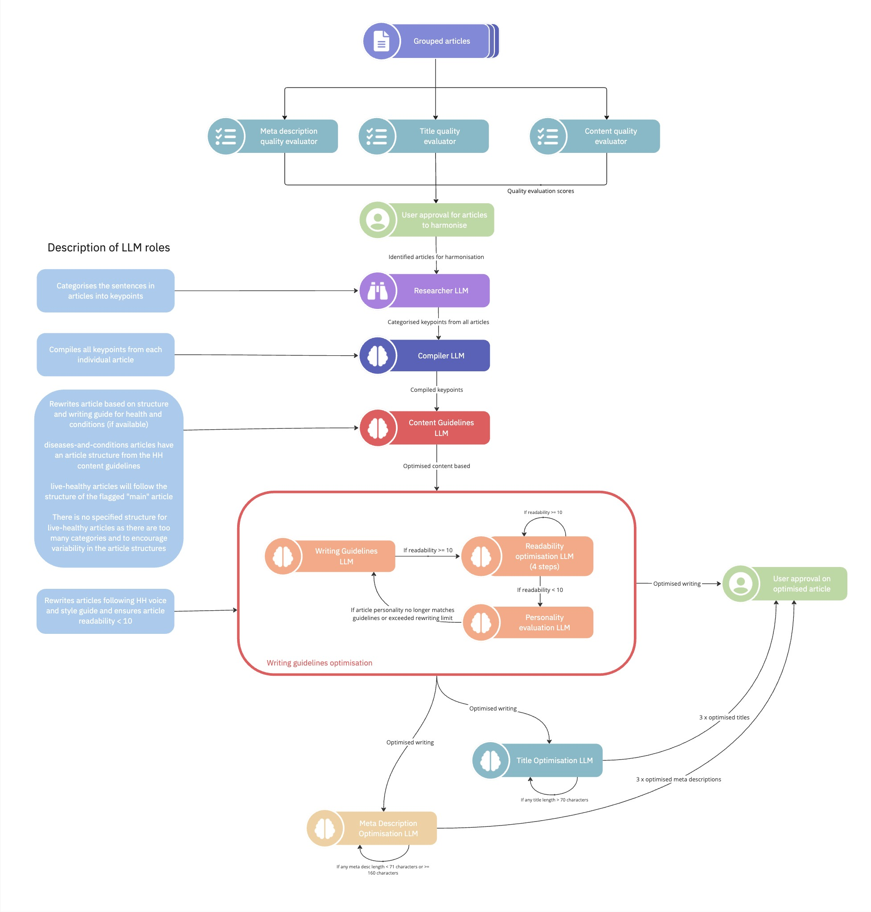

# Introduction

Our primary objective is to reduce the workload in the manual review process. It aims to identify and optimise the articles across four different areas, namely:

1. Article Content
2. Article Writing
2. Article Title
3. Article Meta Description

<h2>
Workflow
</h2>

There are two workflows, namely: Article Optimisation and Article Harmonisation

<h3>
1. Article Optimisation Workflow
</h3>

Article optimisation refers to the process of optimising individual articles.

The first step of article optimisation would be to evaluate the quality of the article based on its content, title and meta description. The article will be evaluated using Rules, Statistics and Large Language Models (LLMs). The output will then be stored on the User Annotation Excel File.

Users will then analyze the evaluation outputs on the User Annotation Excel File and flag out areas to be optimised. Users can choose to flag these areas for optimisation: title, meta description and content.

After user annotation, the article will undergo article optimisation. The flow of article optimisation is as follows:

1. **Researcher node**: This node is used to process the article content. It checks for irrelevant sentences in the article content and categorises them under a separate section.  

2. **Content guidelines optimisation**: Content guidelines optimisation is carried out when the user flags the article for content optimisation. Under article optimisation, only diseases-and-conditions articles will undergo content optimisation. 
  
This process will strucure the article content into a specified structure and rewrite the content to fit the guidelines from the HealthHub content playbook.

3. **Writing guidelines optimisation**: Writing guidelines optimisation is carried out when the user flags the article for writing optimisation. The writing optimisation process aims to rewrite the article content to fit HealthHub's personality guidelines as well as improving the article's Hemingway readability score until it is less than 10. 
  
To achive that, the writing optimisation process consists of feedback loop which assesses the article readability.

4. **Title optimisation**: The title optimisation process involves producing three optimised article titles from the article content. The titles will be optimised based on the HealthHub content playbook guidelines.

5. **Meta description optimisation**: The meta description optimisation process involves producing three optimised meta description from the article content. 

After the article optimisation process has been completed, the optimised output will be stored in the User Annotation Excel file for users to review.

<h3>
2. Article Harmonisation Workflow
</h3>

Article harmonisation refers to the process of harmonising (combining) a group of articles. Articles in the same cluster can be marked for harmonisation, which will lead them to undergo the article harmonisation process. Article harmonisation will optimise all 4 article categories: article content, writing, title and meta description.

The article harmonisation process is largely similar to that of article optimisation, with several exceptions. As such, the description for the article harmonisation process will take reference to the article optimisation process above. 

The article harmonisation process is as follows:

1. **Article Evaluation**: Identical evaluation steps as article optimisation

2. **Researcher node**: Identical researcher node as article optimisation

3. **Compiler node**: The compiler node compiles the keypoints from each article from the researcher node. It combines identical keypoints between the group of processed article keypoints from the Researcher node.

4. **Content guidelines optimisation**: Under article harmonisation, all articles will undergo content guidelines optimisation irregardless of their content category.
  
For disease-and-conditions articles, the process of content optimisation is identical to article optimisation. For live-healthy articles, the compiled article content will be structured based on the structure of a user annoted "main" article.

5. **Writing guidelines optimisation**: Identical writing guidelines optimisation process as article optimisation.

6. **Title optimisation**: Identical title optimisation steps as article optimisation.

7. **Meta description optimisation**: Identical meta description optimisation steps as article optimisation.

The output of article harmonisation will also be stored in the User Annotation Excel file for users to review.
