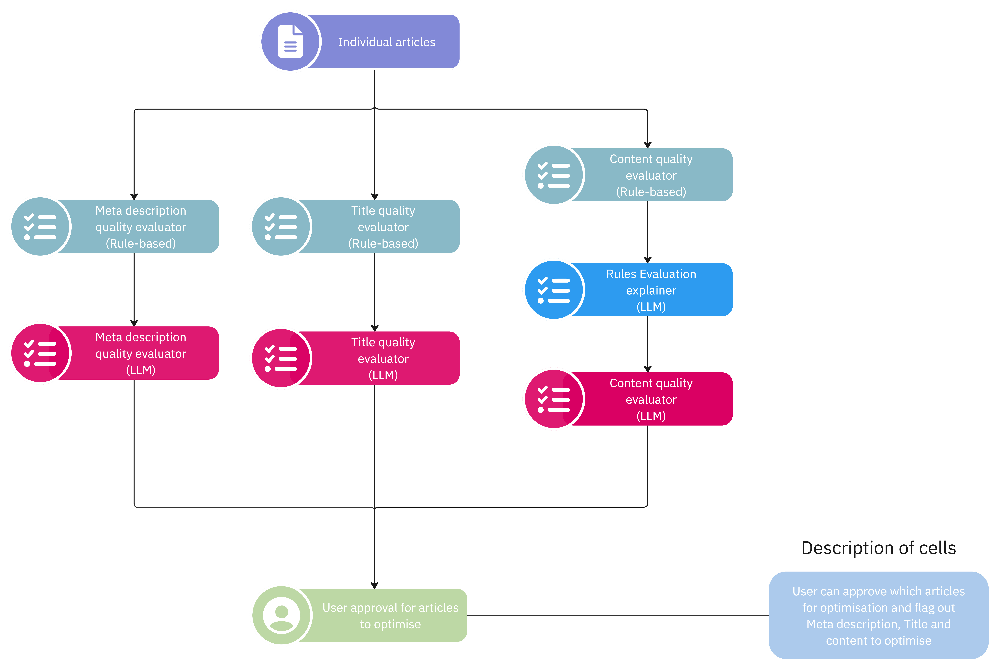

# Optimisation Checks

## Introduction

The `Article Optimisation Checks` workflow focuses on evaluating articles based on their content, title and meta description. We utilise a diverse set of Rule-based, Statistical-based and LLM-based evaluations.

The workflow is executed concurrently where the rule-based and statistical-based evaluations are executed first. This is then followed by the LLM-based evaluations where blocking calls are made to Azure OpenAI Service.

## Notes

### [Azure AI Content Safety](https://learn.microsoft.com/en-us/azure/ai-services/content-safety/overview)

There are times when a selected article may be blocked from LLM generation as it is flagged by the Azure AI Content Filter. As a result, you would be unable to generate the evaluation. Refer to this [link](https://learn.microsoft.com/en-us/azure/ai-services/content-safety/concepts/harm-categories) to explore the harm categories which triggers the content filter.
