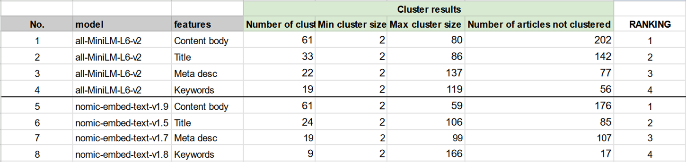
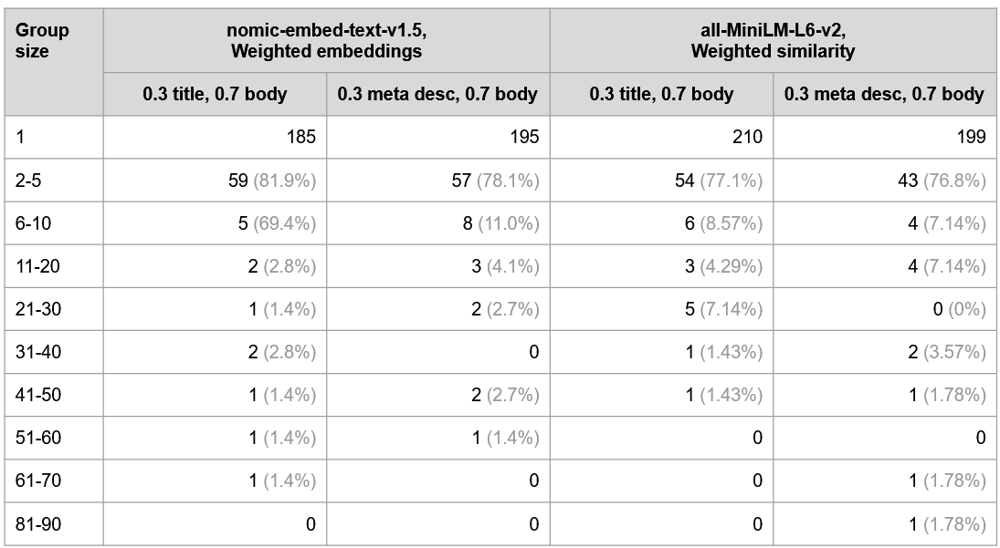
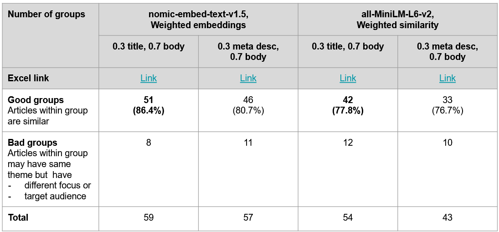

### Introduction

Combining multiple features for clustering provides a richer and more comprehensive representation of the data, allowing the model to capture a broader range of information, leading to more accurate and representative embeddings. Clustering results can be more meaningful when based on a multi-faceted understanding of the data.

### Importance of each Feature

To assess the impact of individual features on clustering performance, clustering was conducted separately on each feature.

The results indicate that article body content and title are the most effective features for clustering similar articles. Both features generated more distinct and meaningful clusters, highlighting their importance in capturing the essence of the articles. In contrast, meta description and keywords produced fewer clusters, suggesting that embeddings derived from these features were less effective in distinguishing between articles.

This finding was consistent across both embedding models used in the study, reinforcing the importance of content body and title in achieving accurate and well-separated clusters.

Titles and body content serve complementary roles. Titles often summarise or highlight the main topic, whereas the body provides depth and context. By incorporating both features, the clustering algorithm can leverage the enhanced contextual understanding and embedding representations, leading to clusters that are more contextually relevant and useful.

### Evaluation

First, we looked at the cluster size breakdown for each model. For both models, combination of content body with title produces higher number of smaller clusters of size ≤ 5.

Next, we evaluated each smaller-sized cluster (those that contains ≤ 5 articles) qualitatively. For both models, combination of content body with title gives:

- Higher absolute number of good groups
- Higher percentage of good groups

### Conclusion

The trend observed across both embedding models reinforces the importance of combining article body content and title in achieving good clustering output. Meta descriptions and keywords were less effective in generating well-separated clusters.
