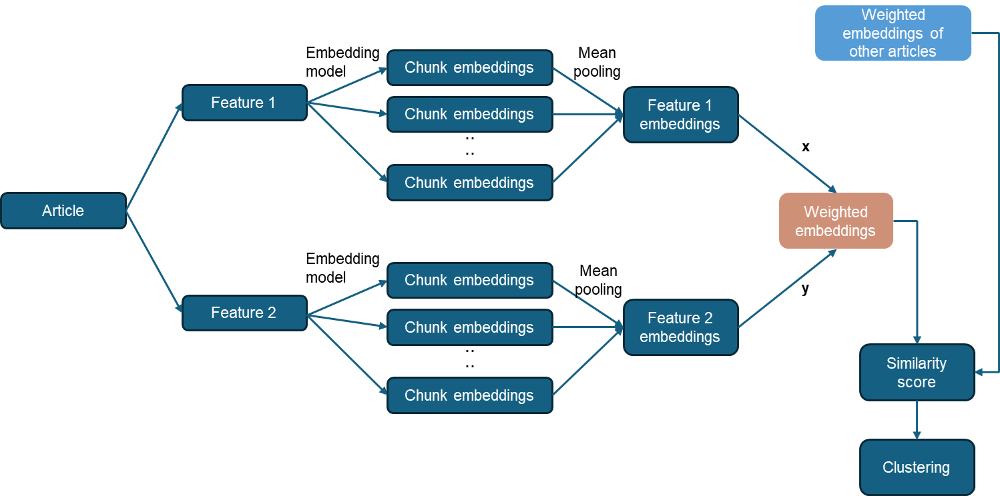
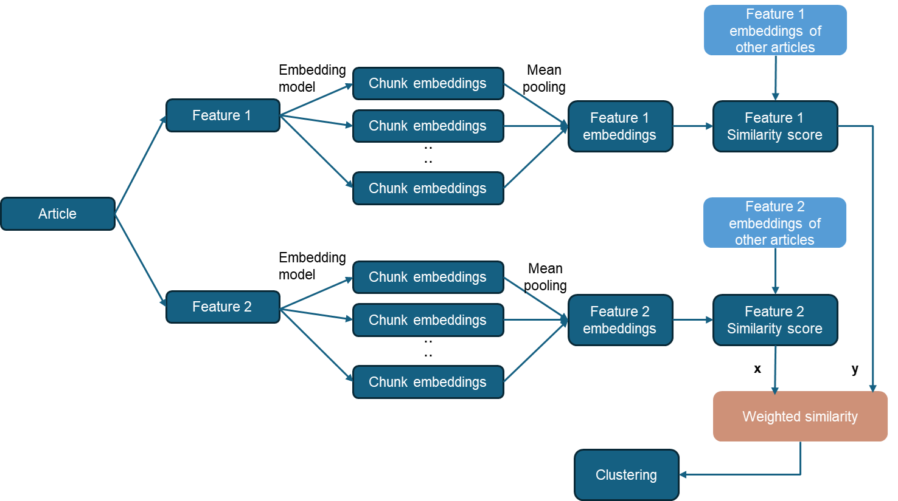
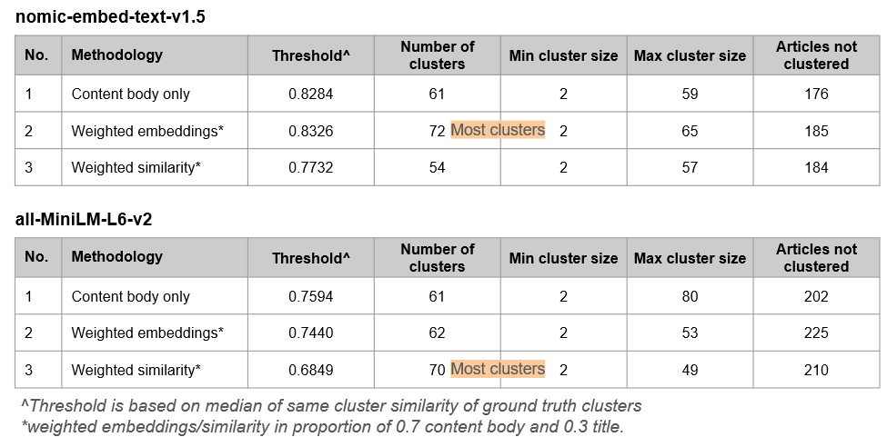

# Multi-feature Clustering Methodology

## Introduction

The following are features from the dataset which may be used for clustering:

1. Article title
2. Article meta description
3. Article body content
4. Keywords (generated using KeyBERT on body content)

Combining multiple features for clustering provides a richer and more comprehensive representation of the data, allowing the model to capture a broader range of information, leading to more accurate and representative embeddings. Clustering results can be more meaningful when based on a multi-faceted understanding of the data.

Two approaches were identified on the use of multiple features for clustering — weighted embeddings approach and weighted similarity approach. This study is conducted using 0.7*body content + 0.3*title for evaluation across the two approaches.

## Methodology

Both methods leverage the benefits of using multiple features while controlling their influence through weightage, which can enhance the ability to capture diverse aspects of article content and improve clustering quality.

### Weighted Embeddings Approach

In the weighted embeddings approach, each feature of the articles, such as article body content and article title, is first embedded into vectors using an embedding model. These feature-specific embeddings are then combined by applying predefined weights to each feature’s embedding, reflecting their relative importance or relevance to the clustering task. This weighted combination results in a single, unified embedding for each article. Subsequently, the similarity scores between these unified embeddings are computed, and clustering is performed using community detection techniques.

### Weighted Similarity Approach

In the weighted similarity approach, cosine similarity scores are first calculated within each feature embeddings. Each article’s similarity score is then adjusted by applying predefined weights that reflect the importance of the corresponding feature. Community detection is then applied to this weighted similarity matrix to identify clusters.

## Evaluation of the Two Approaches

### Quantitative analysis

Quantitative analysis reviewed that

1. For `nomic-embed-text-v1.5` model, the weighted embeddings method produced
   1. more clusters
   2. clusters with less inter-connected edges (i.e. have more distinctly separated clusters)
   3. high proportion of small-sized clusters (88.9% of clusters are of group size 2-10)
2. For `all-MiniLM-L6-v2` model, the weighted similarity method produced
   1. more clusters
   2. clusters with less inter-connected edges (i.e. have more distinctly separated clusters)
   3. high proportion of small-sized clusters (85.7% of clusters are of group size 2-10)

### Qualitative analysis

During qualitative analysis, we looked at the top 5 biggest clusters to evaluate their differences. Generally, output from weighted embedding method is preferred for `nomic-embed-text-v1.5` model as it produces more specific-themed clusters. On the other hand, output from weighted similarity method is preferred for `all-MiniLM-L6-v2` model as it produces more specific-themed clusters.

## Conclusion

The use of multiple features proves to enhance the clustering output, leading to more meaningful and contextually relevant clusters being produced. For subsequent experiments, `nomic-embed-text-v1.5` model with weighted embedding and `all-MiniLM-L6-v2` model with weighted similarity are used.
