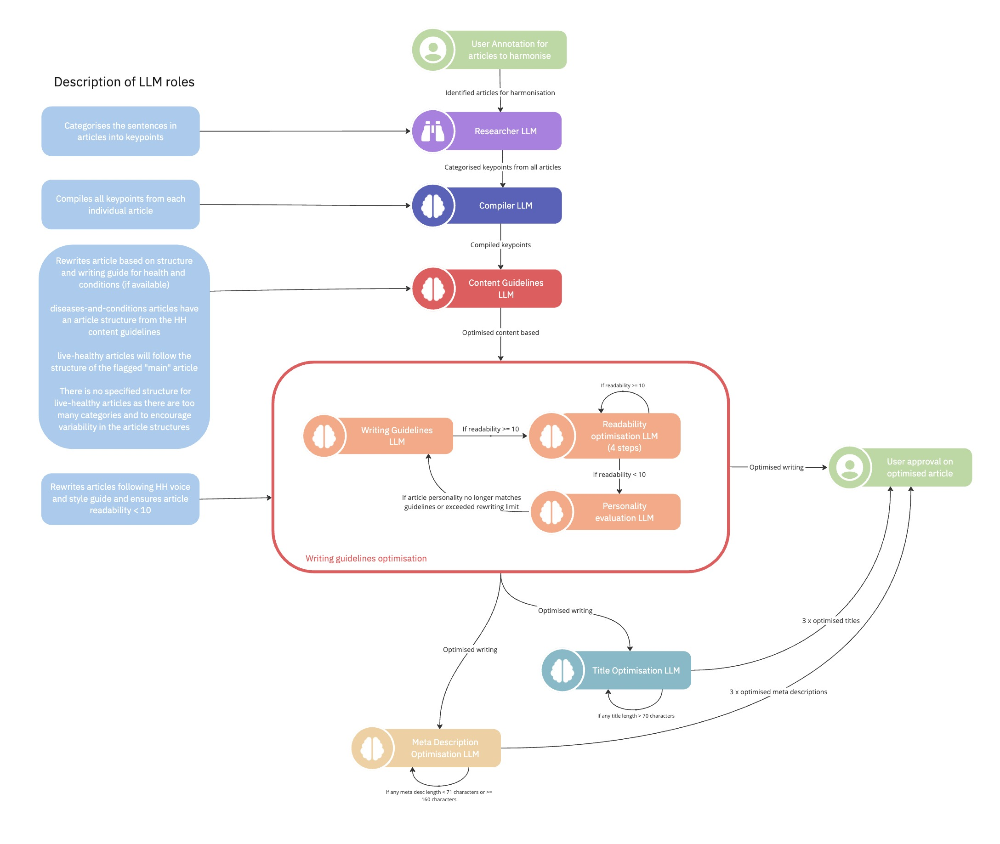

<h2>
Article Harmonisation Workflow
</h2>

<i>Article Harmonisation Workflow diagram</i>

**Article harmonisation** refers to the process of harmonising (combining) a group of articles. Articles in the same cluster can be marked for harmonisation, which will lead them to undergo the article harmonisation process. Article harmonisation will optimise all 4 article categories: article content, writing, title and meta description.

The article harmonisation process is largely similar to that of article optimisation, with several exceptions. As such, the description for the article harmonisation process will take reference to the article optimisation process above.

The article harmonisation process is as follows:

1. **Article Evaluation**: Identical evaluation steps as article optimisation

2. [**Researcher node**](./article-rewriting-nodes/researcher_node.md): This node is used to process the article content. It checks for irrelevant sentences in the article content and categorises them under a separate section.  

3. [**Compiler node**](./article-rewriting-nodes/compiler_node.md): The compiler node compiles the keypoints from each article from the researcher node. It combines identical keypoints between the group of processed article keypoints from the Researcher node.

4. [**Content guidelines optimisation**](./article-rewriting-nodes/content_guidelines_optimisation.md): Under article harmonisation, all articles will undergo content guidelines optimisation irregardless of their content category.
     
   For `disease-and-conditions` articles, the process of content optimisation is identical to article optimisation. For `live-healthy` articles, the compiled article content will be structured based on the structure of a user annoted "main" article.

5. **Writing optimisation**: Writing optimisation is carried out when the user flags the article for writing optimisation. The writing optimisation process aims to rewrite the article content to fit HealthHub's personality guidelines as well as improving the article's Hemingway readability score until it is less than 10.
     
   Writing guidelines is a multi-node process, consisting of a feedback loop with the following nodes: 1. [Writing guidelines optimisation](./article-rewriting-nodes/writing_guidelines_optimisation.md): This node is used to rewrite the article content to meet the voice and personality guidelines of HealthHub's voice and personality guidelines. 2. [Readability optimisaion node](./article-rewriting-nodes/readability_optimisation.md): This node is used to rewrite the article content to improve the article's readability score. The article's readability is scored using the Hemingway scoring system. 3. [Personality evaluation node](./article-rewriting-nodes/personality_evaluation.md): This node is used to evaluate if a readability optimised article still adheres to the HealthHub voice and personality guidelines. This evaluation will be used to determine if the article content requires another round of rewriting or to move on to subsequent optimisation nodes.

6. [**Title optimisation**](./article-rewriting-nodes/title_optimisation.md): The title optimisation process involves producing three optimised article titles from the article content. The titles will be optimised based on the HealthHub content playbook guidelines.

7. [**Meta description optimisation**](./article-rewriting-nodes/meta_desc_optimisation.md): The meta description optimisation process involves producing three optimised meta description from the article content.

After the article optimisation process has been completed, the optimised output will be stored in the User Annotation Excel file for users to review.
