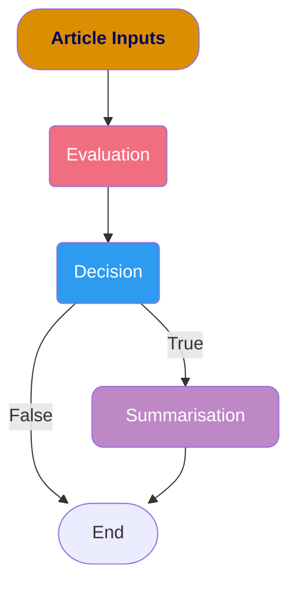

# Introduction

The `Article Optimisation Checks` workflow focuses on evaluating articles based on their content, title and meta description. We utilise a diverse set of Rule-based, Statistical-based and LLM-based evaluations.

The workflow is executed concurrently where the rule-based and statistical-based evaluations are executed first. This is then followed by the LLM-based evaluations where blocking calls are made to Azure OpenAI Service.

## Checks

### Rule-based Checks

Rule-based Checks have clearly defined thresholds that they must be kept within (e.g. Title Length must be within 70 characters). These checks are typically stored in the `flag` parameter within the LangGraph Schema.

### Statistical-based Checks

Statistical-based Checks have thresholds that are defined either by an equation (e.g. Hemmingway Score) or by exploring the distribution of the article's properties (e.g. Word Count).

When the thresholds are very explicit (e.g. Below the 25th percentile of the Word Count Distribution), these checks are only stored in the `flag` parameter within the LangGraph Schema.
However, the thresholds are not explainable (e.g. Readability), the article is submitted to an explainer that explains the evaluation. This is stored in the `judge` parameter of the LangGraph Schema.

### LLM-based Checks

LLM-based Checks are composed of 3 key components - **Evaluation**, **Decision** and **Summarisation**. This is to ensure that the LLM focuses on one key objective at a time, thus lowering the likelihood of hallucinations.

#### Evaluation

The Evaluation component mainly focuses on critiquing the article based on the key criteria provided. All criteria must be stated here. In most cases, the generated critique is long and verbose. However, this is very useful as this evaluation is passed downstream for the LLM to decide whether the article needs to be optimised.

#### Decision

The Decision component is solely focused on deciding whether the article needs to be optimised based on the generated evaluation. It should only output either True or False (boolean) as a `decision` unless the Azure Content Filter has been triggered (The output should be None in this case). If flagged as True, the article evaluation will be passed for summarisation. Otherwise, the outputs are returned from the chain.

#### Summarisation

The Summarisation component is only triggered when the Decision component outputs a True flag. The summarisation component focuses on summarising the verbose evaluation into 3 to 5 sentences. It is meant to be the `explanation` of the decision made.

## Notes

### [Azure AI Content Safety](https://learn.microsoft.com/azure/ai-services/content-safety/overview)

There are times when a selected article may be blocked from LLM generation as it is flagged by the Azure AI Content Filter. As a result, you would be unable to generate the evaluation. Refer to this [link](https://learn.microsoft.com/azure/ai-services/content-safety/concepts/harm-categories) to explore the harm categories which triggers the content filter.

### Implementing new Agents

1. Add in the new agent roles at `agents/enums.py`
2. Implement your new prompt at `agents/prompts.py`
3. Implement the new evaluation chain at `agents/models.py`
4. Define your new state schema at `states/definitions.py`
5. Integrate the new evaluations and their corresponding states into the LangGraph workflow at `checks.py`

After making these changes, you can run the [`checks.py`](https://github.com/Synapxe-DNA/healthhub-content-optimization/blob/main/article-harmonisation/checks.py). Refer to this [`section`](../index.md#setting-up-for-optimisation-checks) to better understand how to setup the Optimisation Checks Workflow.

### Rate Limits

There are times when the rate limits imposed on the Azure OpenAI Service Deployments impacts the article Optimisation Checks. This is usually either due to the quota limits (most likely) or the request limits placed on the Deployment.
To resolve this, you will need to ask the Account Manager (i.e. the person who manages the Resource Groups in the team) to increase the request or quota limits on the deployment.

!!! Note

    The current Azure Account Manager is Wilsven. Reach out to him to increase your quota or rate limits on the Deployment. These changes take some time to be reflected on the endpoint.

### Slow Generation

The LLM generation typically takes a long time during Office Hours. My hypothesis is that the Azure OpenAI Service is being heavily consumed, resulting in slower response times.
However, I am unsure whether it is `model-specific` (i.e. multiple organisations using the same model instance) or `group-specific` (i.e. multiple members using the same model deployment).
I would recommend running this script after Office Hours for faster generation. Otherwise, run this script in a separate terminal session and work on other tasks instead.
Occasionally, check on the progress of the Optimisation Checks workflow. You may run into exceptions or deadlocks.

### Handling Exceptions

Sometimes, when running `checks.py`, you may encounter various exceptions. So far, there are 2 main exceptions - Content Filters and Deadlocks. However, other exceptions will be handled by the process and enter a graceful shutdown process.
The graceful shutdown process includes saving the past optimisation checks in a new parquet file called `agentic_response_*.parquet` in the [`data/optimization_checks`](https://github.com/Synapxe-DNA/healthhub-content-optimization/tree/main/article-harmonisation/data/optimization_checks) directory.
The `*` in the parquet file will be the timestamp `YYYY-MM-DD HH-MM-SS` at which the file was generated. We utilise the Apache Parquet format as the files are immutable.

To avoid running into exceptions deterministically, the articles are typically shuffled (via sampling so that I can limit the number of articles if needed). The idea is to push these problematic articles back so that the other articles can be evaluated.

#### Content Filters

When the Azure OpenAI service triggers a content filter, a `ValueError` exception is raised. A keyword search is first performed (i.e. `"content filter being triggered"` on the error message) to verify whether the Azure AI Content Filter has been triggered.
Once verified, the LLM checks will be turned off and the article is resubmitted for only rule-based checks.

#### Deadlocks

Sometimes, the Optimisation Checks workflow can run into a deadlock. These are the possible reasons -

1. The `EVALUATOR` and `EXPLAINER` Agents are shared across all types of checks (`content`, `title` and `meta description`).
2. The `AzureChatOpenAI` class is making a blocking call (i.e. a synchronous HTTP request) to the Azure OpenAI Service. Hence, the resource must be freed before being used for the next task. Refer to this [link](https://api.python.langchain.com/en/latest/chat_models/langchain_openai.chat_models.azure.AzureChatOpenAI.html) and search `async` on this page to run the chains asynchronously.
3. There is a bug in the LangGraph workflow when performing concurrent execution as the current implementation is synchronous. Refer to this [link](https://langchain-ai.github.io/langgraph/how-tos/async/?h=asynch#define-the-graph) to run the graph asynchronously.

Otherwise, you can simply monitor the execution of the `checks.py` script. If `stdout` (i.e. outputs printed in the terminal) has not changed for at least 4 minutes, you can perform a `Keyboard Interrupt` (i.e. `Ctrl + C` in the terminal session) to end the process.
Past successful generations will then be saved in a new parquet file called `agentic_response_*.parquet`. Once you have performed a successful interrupt, you can rerun the script again. The evaluations will continue for the remaining articles.
