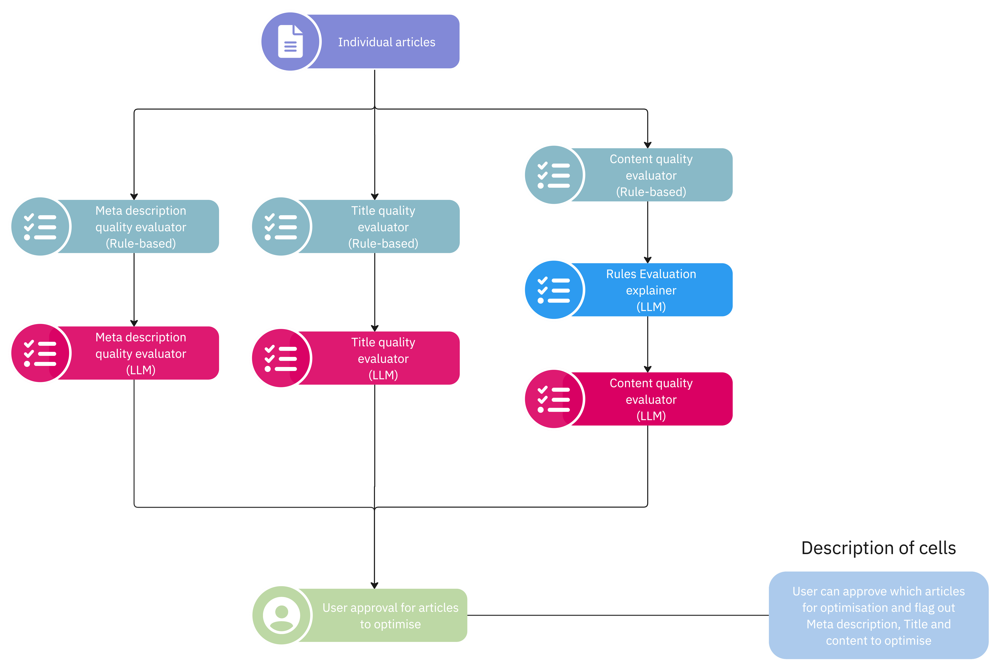
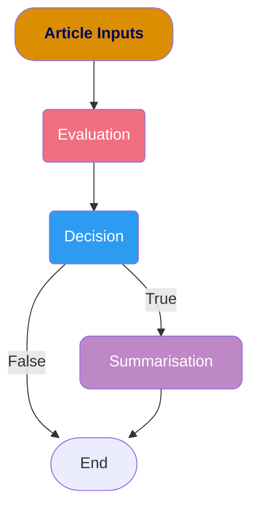

# Introduction

The `Article Optimisation Checks` workflow focuses on evaluating articles based on their content, title and meta description. We utilise a diverse set of Rule-based, Statistical-based and LLM-based evaluations.

The workflow is executed concurrently where the rule-based and statistical-based evaluations are executed first. This is then followed by the LLM-based evaluations where blocking calls are made to Azure OpenAI Service.

## Checks

### Rule-based Checks

Rule-based Checks have clearly defined thresholds that they must be kept within (e.g. Title Length must be within 70 characters). These checks are typically stored in the `flag` parameter within the LangGraph Schema.

### Statistical-based Checks

Statistical-based Checks have thresholds that are defined either by an equation (e.g. Hemmingway Score) or by exploring the distribution of the article's properties (e.g. Word Count).

When the thresholds are very explicit (e.g. Below the 25th percentile of the Word Count Distribution), these checks are only stored in the `flag` parameter within the LangGraph Schema.
However, the thresholds are not explainable (e.g. Readability), the article is submitted to an explainer that explains the evaluation. This is stored in the `judge` parameter of the LangGraph Schema.

### LLM-based Checks

LLM-based Checks are composed of 3 key components - **Evaluation**, **Decision** and **Summarisation**. This is to ensure that the LLM focuses on one key objective at a time, thus lowering the likelihood of hallucinations.

#### Evaluation

The Evaluation component mainly focuses on critiquing the article based on the key criteria provided. All criteria must be stated here. In most cases, the generated critique is long and verbose. However, this is very useful as this evaluation is passed downstream for the LLM to decide whether the article needs to be optimised.

#### Decision

The Decision component is solely focused on deciding whether the article needs to be optimised based on the generated evaluation. It should only output either True or False (boolean) as a `decision` unless the Azure Content Filter has been triggered (The output should be None in this case). If flagged as True, the article evaluation will be passed for summarisation. Otherwise, the outputs are returned from the chain.

#### Summarisation

The Summarisation component is only triggered when the Decision component outputs a True flag. The summarisation component focuses on summarising the verbose evaluation into 3 to 5 sentences. It is meant to be the `explanation` of the decision made.

## Notes

### [Azure AI Content Safety](https://learn.microsoft.com/en-us/azure/ai-services/content-safety/overview)

There are times when a selected article may be blocked from LLM generation as it is flagged by the Azure AI Content Filter. As a result, you would be unable to generate the evaluation. Refer to this [link](https://learn.microsoft.com/en-us/azure/ai-services/content-safety/concepts/harm-categories) to explore the harm categories which triggers the content filter.

### Implementing new Agents

1. Add in the new agent roles at `agents/enums.py`
2. Implement your new prompt at `agents/prompts.py`
3. Implement the new evaluation chain at `agents/models.py`
4. Define your new state schema at `states/definitions.py`
5. Integrate the new evaluations and their corresponding states into the LangGraph workflow at `checks.py`
