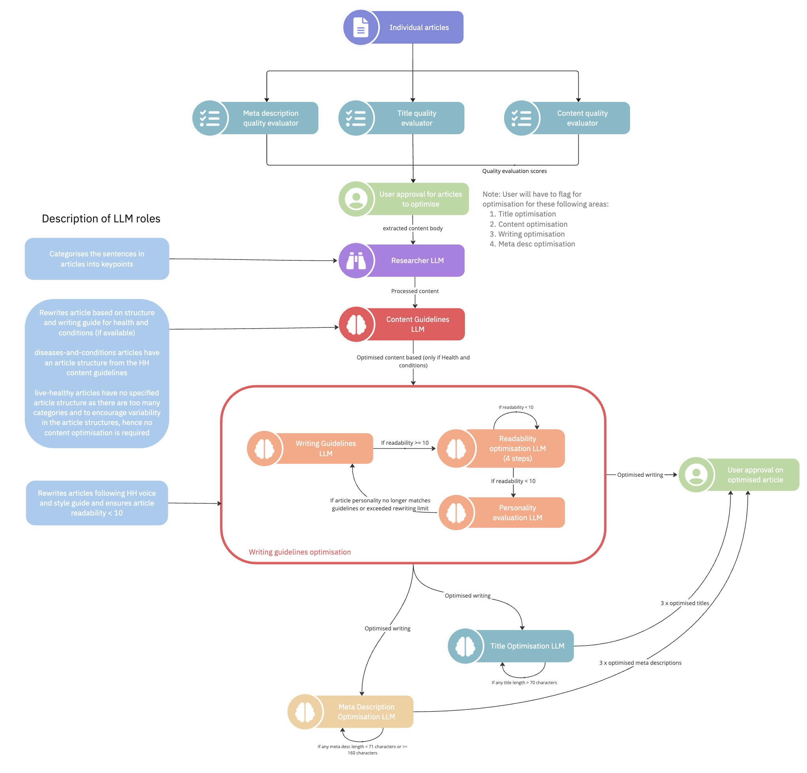
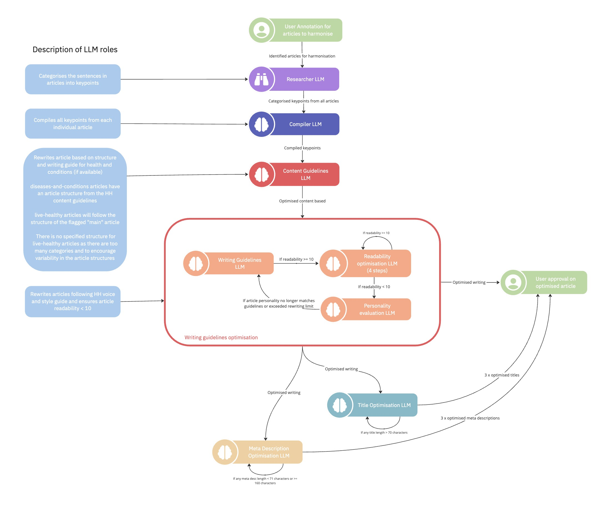

## Introduction

Our primary objective is to reduce the workload in the manual review process. It aims to identify and optimise the articles across three different areas -

1. Article Content
2. Article Title
3. Article Meta Description

## Workflow

### Optimisation Workflow

For individual articles, the initial steps of the Article Rewriting Workflow is to evaluate the quality of the article based on its content, title and meta description. We utilise both Rules, Statistics and Large Language Models (LLMs) to perform these evaluations.
Then, these evaluations are later shared to the users for approval/refinement. Finally, the selected articles (together with their evaluations) are passed down to the `Article Optimisation Flow` to refine and optimise the articles.

### Harmonisation Workflow

For grouped articles, the user will annotate articles to harmonise in the User Annotation Excel file. Following that, these artilces will undergo Article Harmonisation.

## Project Setup

### Setting up for Optimisation Checks

1. Go to the [Step 1 Harmonisation and Optimisation Checks](https://drive.google.com/drive/folders/1ywUNxLDkNLVaYlawjZrz8CX_fKbf5joz) subdirectory within [User Annotation](https://drive.google.com/drive/folders/1kuTAWvOvBRAVP0wmJIjIXdTP9X77j3lI) directory.
2. Fetch the `ids_for_optimisation.csv` file and add it into the `data` subdirectory in the `article-harmonisation` project.
3. Migrate the `merged_data.parquet` from the Kedro Pipeline stored in `content-optimization/data/03_primary` directory.
4. Refer to the `README.md` in `article-harmonisation` to run the project.

### Setting up for Article Rewriting
1. Go to the [Step 1 Harmonisation and Optimisation Checks](https://drive.google.com/drive/folders/1ywUNxLDkNLVaYlawjZrz8CX_fKbf5joz) subdirectory within [User Annotation](https://drive.google.com/drive/folders/1kuTAWvOvBRAVP0wmJIjIXdTP9X77j3lI) directory.
2. Download [Stage 1 user annotation for HPB_sample.xlsx](https://docs.google.com/spreadsheets/d/1-cSXf1ZWmi_p6nr_lCfGl0_F6XSnWpvn/edit?usp=drive_link) and store it in `article-harmonisation/data/article_rewriting/` in the `article-harmonisation` project.
3. Migrate the `merged_data.parquet` from the Kedro Pipeline stored in `content-optimization/data/03_primary` directory.
4. Refer to the `README.md` in `article-harmonisation` to run the project.