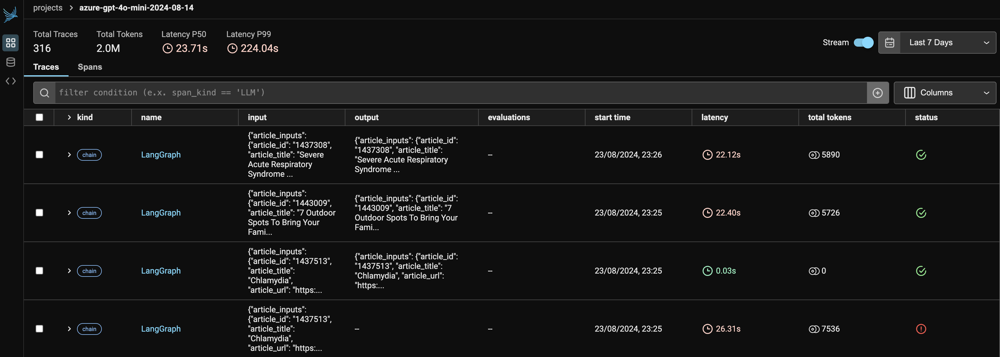

# LLM Observability

## Introduction

Phoenix by Arize AI is an open-source observability library designed for experimentation, evaluation, and troubleshooting. It allows us to visualise the execution of the Agentic Workflows and track down issues.
We mainly use Phoneix to trace the execution of the LangGraph workflows. Refer to these [notebooks](https://docs.arize.com/phoenix/notebooks) to learn more about how to use Phoenix for LLM tracing.

## [Tracing](https://docs.arize.com/phoenix/tracing/llm-traces)

LLM tracing records the paths taken by requests as they propagate through multiple steps or components of an LLM application. Tracing is a helpful tool for understanding how your LLM application works. Phoenix offers comprehensive tracing capabilities that are not tied to any specific LLM vendor or framework.



Phoenix captures the following traces from the LangGraph execution -

- Application Latency: Identify and address slow invocations of LLMs, Retrievers, and other components within your application, enabling you to optimize performance and responsiveness.
- Token Usage: Gain a detailed breakdown of token usage for your LLM calls, allowing you to identify and optimize the most expensive LLM invocations.
- Runtime Exceptions: Capture and inspect critical runtime exceptions, such as rate-limiting events, that can help you proactively address and mitigate potential issues.
- Prompt Templates: Understand the prompt templates used during the prompting step and the variables that were applied, allowing you to fine-tune and improve your prompting strategies.
- LLM Function Calls: For LLMs with function call capabilities (e.g., OpenAI), you can inspect the function selection and function messages in the input to the LLM, further improving your ability to debug and optimize your application.

Refer to this [link](https://docs.arize.com/phoenix/tracing/integrations-tracing/langchain) to learn more about implementing tracing for LangGraph applications.

!!! warning

    Ensure that the Phoenix Server is active when running the LangGraph Agentic Workflows.
    ```python
    # Launches the web server at http://127.0.0.1:6006
    python3 -m phoenix.server.main serve
    ```
