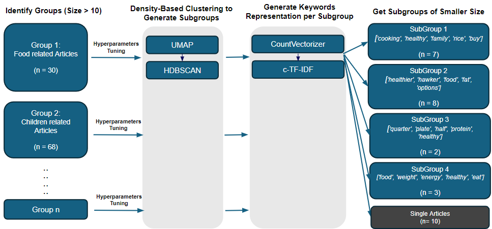
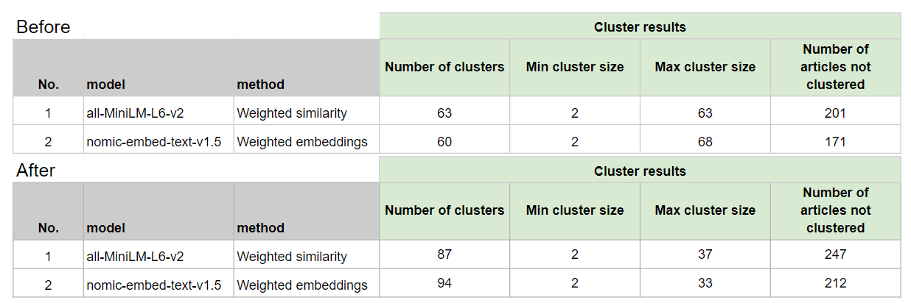

### Introduction

The initial clustering process identified over 60 groups, with 10 to 11 of these groups containing between 11 to 70 articles each. As larger clusters may hinder effective content review, we explored a second level of subclustering to determine if these larger-sized groups can be further subdivided into smaller clusters. This additional layer of refinement aims to improve the manageability and clarity of each cluster.

### Methodology

The second level of clustering involves the following steps:

1. **Identifying clusters that exceed size threshold of 10**
2. **Applying BERTopic to perform subclustering**: This process includes hyperparameter tuning to optimize HDBSCAN, followed by the use of c-TF-IDF to generate the top 5 keywords for each subcluster.

### Evaluation

#### Quantitative Review

| Cluster Size | nomic-embed-text-v1.5 (Before) | nomic-embed-text-v1.5 (After) | all-MiniLM-L6-v2 (Before) | all-MiniLM-L6-v2 (After) |
| ------------ | ------------------------------ | ----------------------------- | ------------------------- | ------------------------ |
| 2-10         | 49                             | 84                            | 52                        | 81                       |
| 11-20        | 5                              | 9                             | 3                         | 4                        |
| 21-30        | 1                              | 0                             | 2                         | 1                        |
| 31-40        | 2                              | 1                             | 2                         | 1                        |
| 41-50        | 1                              | 0                             | 1                         | 0                        |
| 51-60        | 1                              | 0                             | 1                         | 0                        |
| 61-70        | 1                              | 0                             | 1                         | 0                        |
| **Total**    | **60**                         | **94**                        | **62**                    | **87**                   |

The second layer of topic modeling successfully broke down larger clusters into smaller clusters. As a result, clusters with sizes 41 and above were eliminated, showing that the large clusters were effectively split into smaller ones.

For cluster sizes between 11 and 40, these groups still exist, but they are now smaller segments that came from the original larger clusters. This outcome is consistent for both the nomic-embed-text-v1.5 and all-MiniLM-L6-v2 models.

For `nomic-embed-text-v1.5`, the largest cluster that remained after subclustering was a smoking-related group with size of 33.

#### Qualitative Review

- **nomic-embed-text-v1.5**: Out of 45 subgroups, 9 were noted to have issues such as:

      - Articles with a different focus compared to the rest within the subgroup
      - Differing article contexts within the subgroup
      - No clear thematic distinction between the different subgroups

- **all-MiniLM-L6-v2**: Out of 36 subgroups, 13 were noted to have issues such as:

      - No clear thematic distribution between different subgroups
      - Subgroups were too broad, targeting different audiences

### Conclusion

Before the implementation of the second layer of topic modeling, when examining clusters with a size of 5 or less, the `nomic-embed-text-v1.5` model produced a higher absolute number of quality groups compared to the `all-MiniLM-L6-v2` model. Additionally, the `nomic-embed-text-v1.5` model also produced a higher percentage of good groups in comparison to the `all-MiniLM-L6-v2` model.

After the second layer of topic modeling, both models produced approximately 80% quality subgroups:

- nomic-embed-text-v1.5: 36 out of 45 subgroups (~80%).
- all-MiniLM-L6-v2 Model: 23 out of 36 subgroups (~79%).

The `nomic-embed-text-v1.5` model tends to produce more clusters and slightly smaller cluster sizes compared to the `all-MiniLM-L6-v2` model. Importantly, the `nomic-embed-text-v1.5` model consistently produces at least one valid subgroup per group.

Based on these findings, it is recommended to proceed with the `nomic-embed-text-v1.5` model due to its consistent performance in producing more valid subgroups and better managing cluster sizes.
