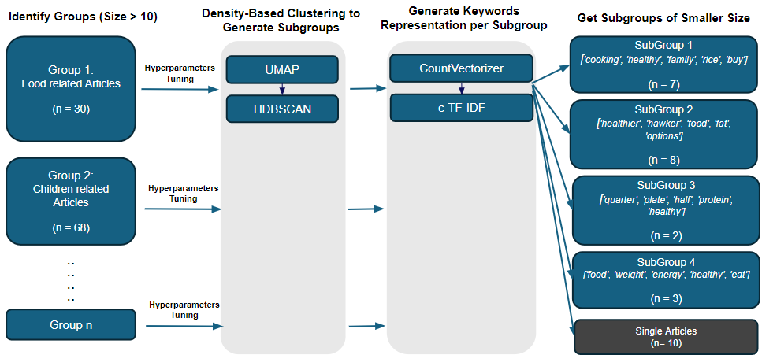

# Introduction

Our primary goal is to reduce the workload associated with the manual review process by presenting groups of similar articles. This enables easier annotation, helping to determine which articles should be removed, harmonized, or optimized. This work lays the foundation for future content optimization and harmonization.

## Workflow

The initial layer of our clustering approach employs graph-based methods to form preliminary groupings of related articles. This is achieved by leveraging the similarities in various article features, such as content body, article titles, and meta descriptions provided in the dataset.

Following this, the second level of clustering utilises BERTopic to further refine the larger-sized clusters output from the first level of clustering. This additional step is necessary as the first level of clustering still produces clusters with number of articles ranging from 11 to 70, which are too large and not optimal for user review. By performing the second level of clustering, we aim to create more specific and smaller cluster. In this step, keywords are also generated to represent each cluster's content.

## Exploration

Various techniques were evaluated in the first level of clustering. The experimentation focused on different embedding techniques, multi-feature clustering methodologies, and feature selection to determine the most effective approach for clustering related articles.

The image below summarizes the key findings and decisions made during this experimentation process:

Based on these findings, the selected approach for the first level of clustering is the `nomic-embed-text-v1.5 model`, utilizing weighted embeddings with a weighting scheme of 0.7 for content body and 0.3 for title. This method has been shown to generate more accurate and manageable clusters for user review.
